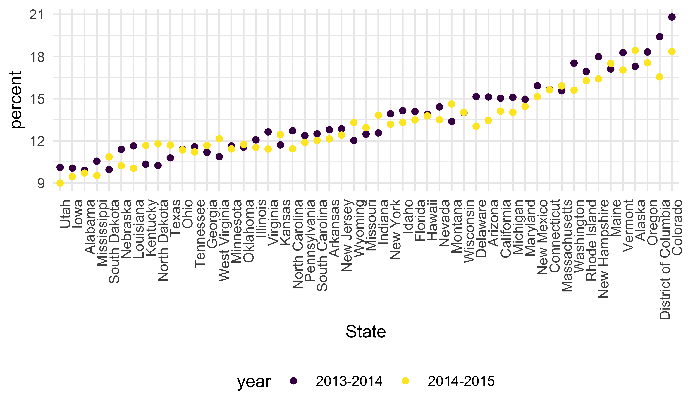
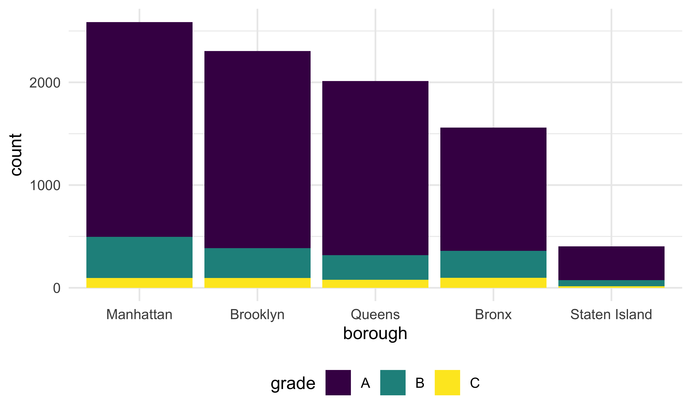
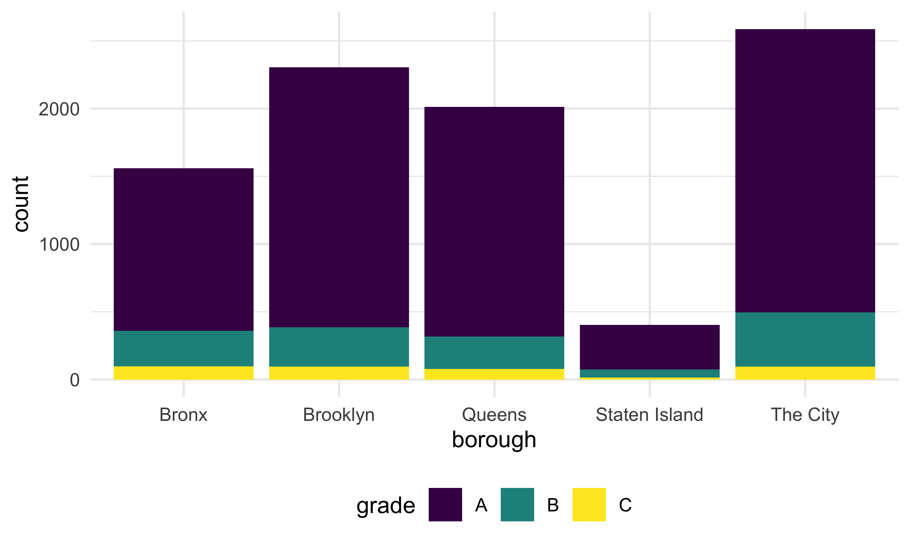

strings_and_factors
================
Bohan Zhu
2025-10-23

``` r
library(tidyverse)
```

    ## ── Attaching core tidyverse packages ──────────────────────── tidyverse 2.0.0 ──
    ## ✔ dplyr     1.1.4     ✔ readr     2.1.5
    ## ✔ forcats   1.0.0     ✔ stringr   1.5.1
    ## ✔ ggplot2   3.5.2     ✔ tibble    3.3.0
    ## ✔ lubridate 1.9.4     ✔ tidyr     1.3.1
    ## ✔ purrr     1.1.0     
    ## ── Conflicts ────────────────────────────────────────── tidyverse_conflicts() ──
    ## ✖ dplyr::filter() masks stats::filter()
    ## ✖ dplyr::lag()    masks stats::lag()
    ## ℹ Use the conflicted package (<http://conflicted.r-lib.org/>) to force all conflicts to become errors

``` r
library(rvest)
```

    ## 
    ## Attaching package: 'rvest'
    ## 
    ## The following object is masked from 'package:readr':
    ## 
    ##     guess_encoding

## Mostly use string vectors

``` r
string_vec= c("my","name","is","Bohan")

str_detect(string_vec,"Bohan")
```

    ## [1] FALSE FALSE FALSE  TRUE

``` r
str_detect(string_vec,"e")
```

    ## [1] FALSE  TRUE FALSE FALSE

``` r
str_detect(string_vec,"Zhu")
```

    ## [1] FALSE FALSE FALSE FALSE

``` r
str_replace(string_vec,"Bohan","Bohan Zhu")
```

    ## [1] "my"        "name"      "is"        "Bohan Zhu"

``` r
str_replace(string_vec,"e", "")
```

    ## [1] "my"    "nam"   "is"    "Bohan"

``` r
str_remove(string_vec,"e")
```

    ## [1] "my"    "nam"   "is"    "Bohan"

``` r
string_vec = c(
  "i think we all rule for participating",
  "i think i have been caught",
  "i think this will be quite fun actually",
  "it will be fun, i think"
  )

str_detect(string_vec, "^i think") #start from I think
```

    ## [1]  TRUE  TRUE  TRUE FALSE

``` r
str_detect(string_vec, "i think$") #end with I think
```

    ## [1] FALSE FALSE FALSE  TRUE

``` r
str_remove(string_vec,"i think$")
```

    ## [1] "i think we all rule for participating"  
    ## [2] "i think i have been caught"             
    ## [3] "i think this will be quite fun actually"
    ## [4] "it will be fun, "

``` r
string_vec = c(
  "Time for a Pumpkin Spice Latte!",
  "went to the #pumpkinpatch last weekend",
  "Pumpkin Pie is obviously the best pie",
  "SMASHING PUMPKINS -- LIVE IN CONCERT!!"
  )

str_detect(string_vec,"[Pp]umpkin")
```

    ## [1]  TRUE  TRUE  TRUE FALSE

Let’s get a bit more complicated.

``` r
string_vec = c(
  '7th inning stretch',
  '1st half soon to begin. Texas won the toss.',
  'she is 5 feet 4 inches tall',
  '3AM - cant sleep :('
  )

str_detect(string_vec, "^[0-9][a-zA-Z]") 
```

    ## [1]  TRUE  TRUE FALSE  TRUE

``` r
string_vec = c(
  'Its 7:11 in the evening',
  'want to go to 7-11?',
  'my flight is AA711',
  'NetBios: scanning ip 203.167.114.66'
  )

str_detect(string_vec, "7.1") #want to find 7 followed by 1
```

    ## [1] TRUE TRUE TRUE TRUE

``` r
#if we want to see just .1
str_detect(string_vec, "7\\.1") 
```

    ## [1] FALSE FALSE FALSE  TRUE

``` r
string_vec = c(
  'The CI is [2, 5]',
  ':-]',
  ':-[',
  'I found the answer on pages [6-7]'
  )

str_detect(string_vec, "\\[")
```

    ## [1]  TRUE FALSE  TRUE  TRUE

## Factros

``` r
vec_sex = factor(c("male", "male", "female", "female"))
vec_sex
```

    ## [1] male   male   female female
    ## Levels: female male

``` r
as.numeric(vec_sex)
```

    ## [1] 2 2 1 1

``` r
vec_sex = fct_inorder(vec_sex)
vec_sex #we make male as the reference
```

    ## [1] male   male   female female
    ## Levels: male female

## Revisit NSDUH

``` r
url = "http://samhda.s3-us-gov-west-1.amazonaws.com/s3fs-public/field-uploads/2k15StateFiles/NSDUHsaeShortTermCHG2015.htm"
```

``` r
drug_use_html = read_html(url)

ndsuh_df = 
  drug_use_html |> 
  html_table() |> 
  first() |> 
  slice(-1)
```

Now do the tidying

``` r
marj_df = 
  ndsuh_df |>
  select(-contains("P Value")) |>
  pivot_longer(
    -State,
    names_to = "age_year", 
    values_to = "percent") |> 
  separate(age_year, into = c("age", "year"), sep = "\\(") |>
  mutate(
    year = str_replace(year, "\\)", ""),
    percent = str_replace(percent, "[a-c]$", ""),
    percent = as.numeric(percent)) |>
  filter(!(State %in% c("Total U.S.", "Northeast", "Midwest", "South", "West")))
```

Let’s make quick plot

``` r
marj_df |>
  filter(age == "12-17") |> 
  mutate(State = fct_reorder(State, percent)) |> 
  ggplot(aes(x = State, y = percent, color = year)) + 
    geom_point() + 
    theme(axis.text.x = element_text(angle = 90, hjust = 1))
```



## Restaurant Inspections!

``` r
library(p8105.datasets)
data("rest_inspec")
```

``` r
rest_inspec = 
    rest_inspec |> 
    rename(borough = boro)

rest_inspec |> 
  group_by(borough, grade) |> 
  summarize(n = n()) |> 
  pivot_wider(
    names_from = grade,
    values_from = n)
```

    ## `summarise()` has grouped output by 'borough'. You can override using the
    ## `.groups` argument.

    ## # A tibble: 6 × 9
    ## # Groups:   borough [6]
    ##   borough           A     B     C  `NA`     N     P     Z     G
    ##   <chr>         <int> <int> <int> <int> <int> <int> <int> <int>
    ## 1 0                33     9     6    67    NA    NA    NA    NA
    ## 2 Bronx         14071  2611   976 17190   161   236   605    NA
    ## 3 Brooklyn      38896  6423  2194 49825   345   782  1168     2
    ## 4 Manhattan     61675  9107  3600 76581   591   924  1816     3
    ## 5 Queens        36258  5526  1996 44136   350   604  1287    NA
    ## 6 Staten Island  5410   855   248  6315    71    61   116    NA

Update the dataset

``` r
rest_inspec =
  rest_inspec |> 
  filter(
    grade %in% c("A", "B", "C"),
    borough !=0)
```

Look for pizza places

``` r
rest_inspec |> 
  filter(str_detect(dba, "Pizza")) |> 
  group_by(borough, grade) |> 
  summarize(n = n()) |> 
  pivot_wider(
    names_from = grade,
    values_from = n)
```

    ## `summarise()` has grouped output by 'borough'. You can override using the
    ## `.groups` argument.

    ## # A tibble: 4 × 3
    ## # Groups:   borough [4]
    ##   borough       A     B
    ##   <chr>     <int> <int>
    ## 1 Bronx        15     3
    ## 2 Brooklyn     15    NA
    ## 3 Manhattan    13     3
    ## 4 Queens       11     4

``` r
rest_inspec |> 
  filter(str_detect(dba, "[Pp][Ii][Zz][Zz][Aa]")) |> 
  group_by(borough, grade) |> 
  summarize(n = n()) |> 
  pivot_wider(
    names_from = grade,
    values_from = n)
```

    ## `summarise()` has grouped output by 'borough'. You can override using the
    ## `.groups` argument.

    ## # A tibble: 5 × 4
    ## # Groups:   borough [5]
    ##   borough           A     B     C
    ##   <chr>         <int> <int> <int>
    ## 1 Bronx          1201   261    98
    ## 2 Brooklyn       1919   291    95
    ## 3 Manhattan      2091   400    96
    ## 4 Queens         1695   239    78
    ## 5 Staten Island   328    60    15

Let’s make this table a plot instead

``` r
rest_inspec |> 
  filter(str_detect(dba, "[Pp][Ii][Zz][Zz][Aa]")) |> 
  mutate(borough = fct_infreq(borough)) |> 
  ggplot(aes(x = borough, fill = grade)) +
  geom_bar()
```



This doesn’t work as I wanted

``` r
rest_inspec |> 
  filter(str_detect(dba, "[Pp][Ii][Zz][Zz][Aa]")) |> 
  mutate(
    borough = fct_infreq(borough),
    borough = str_replace(borough, "Manhattan", "The City")) |>   
  ggplot(aes(x = borough, fill = grade)) +
  geom_bar()
```



but this does.

``` r
rest_inspec |> 
  filter(str_detect(dba, "[Pp][Ii][Zz][Zz][Aa]")) |> 
  mutate(
    borough = fct_infreq(borough),
    borough = fct_recode(borough, "The city" = "Manhattan")
    )|>   
  ggplot(aes(x = borough, fill = grade)) +
  geom_bar()
```


